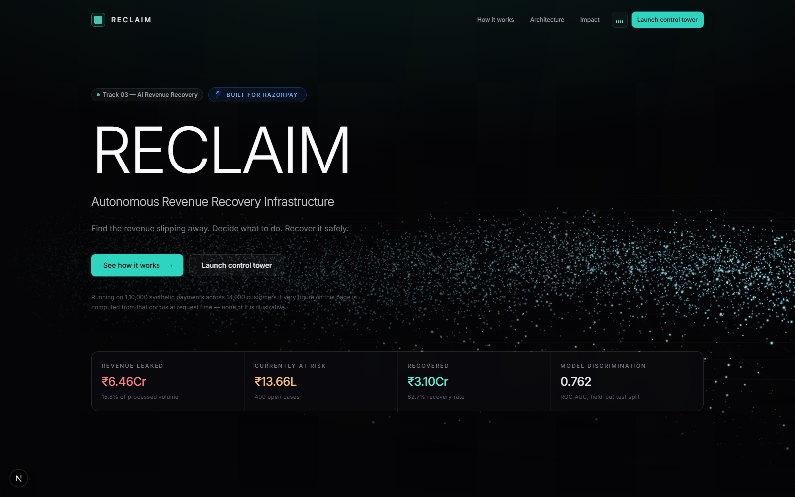
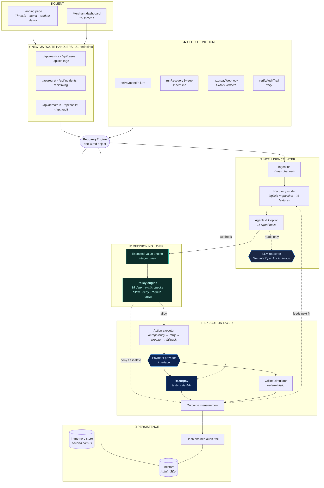
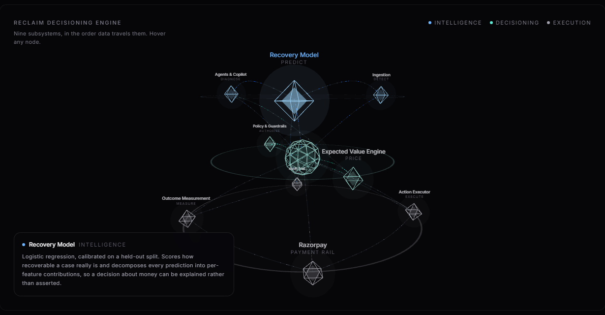
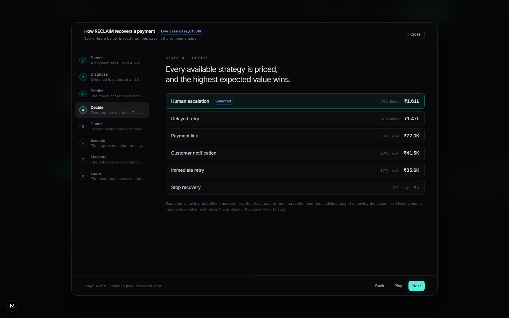
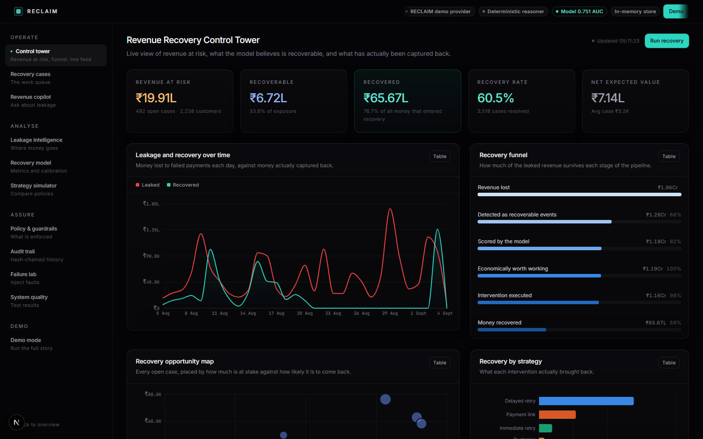

# RECLAIM

**Autonomous Revenue Recovery Infrastructure**

> Find the revenue slipping away. Decide what to do. Recover it safely.

RECLAIM is a decisioning layer that sits above payment infrastructure. Razorpay and its
peers give merchants excellent rails and rich failure signals; what sits above that layer
is unsolved. Given thousands of revenue-loss events, which are actually recoverable, what
should be done about each one, what does it cost, and did it work?

This repository is a complete, running answer to that question:

```
Detect → Diagnose → Predict → Decide → Guard → Execute → Measure → Learn
```



---

## Table of contents

| | | |
|---|---|---|
| [Hackathon track](#hackathon-track) | [The problem](#the-problem-we-solved) | [Objectives](#project-objectives) |
| [Quick start](#quick-start) | [Our solution](#our-solution) | [Key features](#key-features) |
| [Architecture](#architecture) | [Technical stack](#technical-stack) | [AI implementation](#ai-implementation) |
| [Razorpay integration](#razorpay-integration) | [Landing page](#the-landing-page) | [The data](#the-data) |
| [The model](#the-model) | [The guardrails](#the-guardrails) | [Testing](#testing) |
| [Security](#security) | [Firebase](#firebase) | [Project structure](#project-structure) |
| [Deployment](#deployment) | [Challenges](#challenges-we-faced) | [Design decisions](#design--product-decisions) |
| [Impact](#project-impact) | [Future work](#future-improvements) | [Learnings](#buildathon-learnings) |

---

## Hackathon track

**Track 3 — AI Revenue Recovery.**

### Why we chose it

The other tracks ask you to build something new on top of a payment rail. This one asks a
harder and more honest question: *money is already being lost, right now, in every
merchant's account — can you get it back?* That framing appealed to us because it comes
with a scoreboard. You cannot hand-wave revenue recovery. Either the money came back or it
did not, and the difference is measurable in rupees.

It is also the track where a language model is genuinely useful **and** genuinely dangerous,
which made it the most interesting engineering problem on the list. Recovery decisions are
judgement calls over messy, incomplete context — exactly what an LLM is good at. They are
also decisions that move real money — exactly what an LLM must never be trusted to do
unsupervised. Building something that uses AI where it helps and refuses to use it where it
would be reckless was the part worth doing well.

### Why the track fits this project

| What Track 3 asks for | What RECLAIM does |
|---|---|
| Recover revenue lost to payment failures | Detects loss across four channels, not just declines: failed payments, subscription dunning, abandoned checkouts and overdue invoices |
| Use AI meaningfully | An ML model scores recoverability; an LLM diagnoses and explains. Each does the job it is actually suited to |
| Integrate with Razorpay | Provider abstraction with a real Razorpay test-mode implementation — payment links are created for real and return real `short_url`s |
| Show measurable results | Every figure on every screen is computed from stored records at request time. Nothing is hardcoded |
| Be production-shaped | Idempotency, bounded retries, circuit breakers, a deterministic policy engine, a hash-chained audit trail, and 205 tests |

### What makes our approach different

Most recovery tooling is a **retry scheduler with a dashboard**: it retries failed payments
on a cadence and reports how many succeeded. Three things separate RECLAIM from that.

1. **It decides whether to act at all.** Every intervention is priced in integer paise —
   probability × amount, minus the direct cost, minus the modelled cost of annoying the
   customer. *Doing nothing scores exactly zero*, so every other option has a hurdle to
   clear. An engine that cannot choose to stop will always find a reason to spend money.

2. **The AI cannot move money.** The reasoning layer chooses among options that have
   *already been priced* and explains the choice. A separate deterministic engine — ordinary
   code, no model in the path — decides what is permitted. This is architectural, not a
   prompt instruction.

3. **It prices its own caution.** Every recovery system reports what it recovered. RECLAIM
   also reports what its safety rules **cost** to enforce, estimated from what comparable
   permitted actions actually realised. An unpriced guardrail only ever ratchets tighter.

---

## The problem we solved

### The real-world problem

Payment failure is not an edge case; it is a permanent, structural leak. In the corpus this
system runs on — generated to mirror realistic Indian payment behaviour — **18% of payment
volume fails**. On ₹34.5 crore of captured revenue, that is **₹6.46 crore** of gross
attempted revenue that failed to settle.

Most of it is not fraud and not customer intent. It is insufficient funds on the 28th of the
month, an expired card on a subscription, a 3DS challenge the customer abandoned, an issuer
having a bad twenty minutes. A large share of it is recoverable. Almost none of it is
recovered, because nobody can tell which share is which.

### Why recovery is hard

- **Failure reasons are not equally recoverable.** `insufficient_funds` often clears itself
  in 48 hours. `card_expired` never clears on retry, at any price — it needs a new
  instrument. Treating them identically wastes money on one and abandons the other.
- **Retrying has a cost, and it is not just the fee.** Every message to a customer spends
  goodwill. Retry aggressively enough and you convert a recoverable payment into a
  chargeback and a churned customer.
- **The naive strategies are both wrong.** Retry everything and you burn cost and goodwill
  on the unrecoverable. Retry nothing and you leave the recoverable on the table. The
  optimum is per-case and depends on quantities nobody is measuring.
- **Failures are correlated.** When an issuer goes down, hundreds fail at once. Retrying
  into a dead endpoint burns the retry budget on every affected case simultaneously and
  fatigues customers for nothing.
- **Timing is a variable nobody controls.** The same retry has materially different odds at
  different points in the month, because liquidity is periodic.

### Who faces it

Any business taking recurring or high-volume online payments: subscription SaaS, D2C
commerce, EMI and lending, insurance premiums, education fees, utilities. The larger the
payment volume, the larger the absolute leak — and the less feasible it is to work cases by
hand.

### Limitations of traditional approaches

| Approach | Limitation |
|---|---|
| **Fixed retry schedules** ("retry after 1h, 24h, 72h") | Ignores the failure reason, the customer's history and the amount at stake. Identical treatment for a ₹99 and a ₹99,000 failure |
| **Rule-based dunning** | Rules are written once and never priced. Nobody knows what a rule costs, so rules only ever get stricter |
| **Manual recovery ops** | Does not scale past a few hundred cases, and the reasoning lives in one person's head |
| **Generic "AI agents"** | Let a language model decide and execute. Non-deterministic, unauditable, and a hallucinated amount is a real charge |

### How RECLAIM addresses it

It puts a **measurement and decisioning layer** between the failure signal and the
intervention: score recoverability with a calibrated model, price every option in paise,
authorise through deterministic guardrails, execute exactly once, measure what actually
happened, and feed that back. The AI participates in the parts that are judgement, and is
structurally prevented from participating in the parts that are arithmetic and authorisation.

---

## Project objectives

### Business objectives

1. **Recover revenue that is currently written off** — convert a measurable share of failed
   payments into captured payments.
2. **Stop spending money on unrecoverable cases** — refusing to act is a feature, and it is
   priced.
3. **Protect the customer relationship** — contact caps, quiet hours in the customer's own
   timezone, and consent as a hard gate that no expected value can override.
4. **Make the trade-off visible** — quantify what the safety rules cost as well as what
   recovery earns, so policy is set on evidence rather than on anxiety.
5. **Automate the routine, escalate the material** — high-value or low-confidence decisions
   go to a human by policy, not by luck.

### Technical / product objectives

1. **The LLM must never control money.** Enforced by architecture: a deterministic policy
   engine and action executor sit between any recommendation and any charge.
2. **Never double-charge.** An idempotency key is claimed transactionally *before* the side
   effect, and a test fails if that ordering is reversed.
3. **Every number must be computed, not asserted.** No hardcoded dashboard values anywhere.
4. **Degrade, don't crash.** Every external dependency is optional and behind an interface;
   losing one downgrades a subsystem and the UI says which mode is active.
5. **Be auditable.** Append-only, hash-chained decision history, verified by replay.
6. **Run from a clean clone with no credentials.** `npm install && npm run bootstrap && npm run dev`.

---

## Quick start

Three commands. No credentials, no accounts, no external services.

```bash
npm install
npm run bootstrap    # generate the synthetic corpus, then train the model
npm run dev          # http://localhost:3000
```

`npm run bootstrap` writes a deterministic corpus to `data/` and fits the
recovery-probability model on it. The dashboard is populated the moment it opens.

To see the whole system work end to end, open **Demo mode** and press *Run live recovery*.
To see the pipeline explained on a real case, press **See how it works** on the landing page.

> The dev server honours `PORT`, so `PORT=3001 npm run dev` works if 3000 is taken.

### Verifying the build

```bash
npm run verify       # typecheck → full test suite + quality report → production build
```

---

## Our solution

### What the application does

RECLAIM watches for revenue-loss events, opens a **recovery case** for each one, and drives
that case through a closed loop until the money is either recovered or the case is
deliberately closed.

```
Detect → Diagnose → Predict → Decide → Guard → Execute → Measure → Learn
```

### From first interaction to final outcome

Walking one case end to end — this is exactly what the **See how it works** demo animates,
using a real case pulled from the running engine:

| Stage | What happens | Who decides |
|---|---|---|
| **1. Detect** | A payment fails. Ingestion picks it up from one of four channels and opens a case with the amount at risk | Deterministic |
| **2. Diagnose** | The analyst agent calls typed tools to gather customer context, payment history, subscription state and prior attempts, then classifies the failure against a 17-reason taxonomy | **LLM** (reads and reasons) |
| **3. Predict** | The recovery-probability model scores how recoverable this case actually is, and decomposes the score into per-feature contributions | ML model |
| **4. Decide** | The expected-value engine prices all six strategies in paise: probability × amount − direct cost − goodwill cost | Deterministic |
| **5. Guard** | The policy engine runs 18 checks. Verdict: allow, deny, or require human | Deterministic |
| **6. Execute** | The action executor claims an idempotency key, then calls the payment provider under a bounded retry with a circuit breaker and a fallback chain | Deterministic |
| **7. Measure** | The outcome is recorded against the case. Only captured money counts as recovered | Deterministic |
| **8. Learn** | The realised outcome becomes evidence — for the next model fit, and for the regret ledger that prices the guardrails | Deterministic |

### How the components work together

The whole system is **one wired object** (`RecoveryEngine`) with the subsystems injected
into it. A Cloud Function trigger, a Next.js route handler and a test all construct the same
engine — there is no second implementation of anything.

### How it identifies, reduces and recovers lost revenue

- **Identifies** — ingestion across four loss channels, plus leakage analytics that attribute
  loss by failure reason, method, bank, customer segment, amount band and hour of day.
- **Reduces** — the expected-value floor and the policy engine stop money being spent on
  cases that cannot be recovered profitably. Systemic incident detection stops retries being
  burned into an issuer that is already down.
- **Recovers** — the executor runs the authorised strategy against the payment rail, falls
  back when an option is blocked, and books only what the provider actually captured.

---

## Key features

Every feature listed here is implemented in this repository and reachable in the UI.

| Signature feature | What it actually is |
|---|---|
| **Revenue Recovery Control Tower** | Revenue at risk, model-weighted recoverable revenue, measured recovered revenue, the recovery funnel, a live opportunity map and the guardrail scoreboard — all computed from stored records at request time |
| **Recovery probability model** | A calibrated logistic regression over 26 features, trained with a real train/validation/test split. Reported metrics come from the artifact, not from the UI source |
| **Expected-value engine** | Prices all six interventions in integer paise: success probability × amount, minus direct cost, minus the goodwill cost of asking the customer again. Doing nothing scores exactly zero |
| **Policy & guardrail engine** | Eighteen deterministic checks between a recommendation and a charge. The AI proposes; this authorises |
| **Recovery opportunity graph** | The customer neighbourhood — payments, failures, subscriptions, prior interventions and their outcomes — rendered on the case screen and feeding the model's relational features |
| **AI decision inspector** | The complete chain for any recommendation: detected problem, weighted signals, probability, priced options, guardrail verdicts, action, measured outcome |
| **Merchant copilot** | Natural-language questions answered from real queries. Every figure is echoed back with the tool that produced it |
| **Strategy simulator** | Replays the portfolio under six competing policies with identical seeded draws, so differences are attributable to the decision rather than to luck |
| **Failure lab** | Arms any of seven faults and shows the system falling back, degrading or escalating instead of breaking |
| **Audit trail** | Append-only and hash-chained. Verified by replay on every read, not by a stored flag |
| **Guardrail regret ledger** | Prices what the safety rules cost. Blocked exposure is counted; foregone recovery is estimated from the rate the same strategies actually realised where they were permitted — never from the model, which would be arguing for itself. Proposes bounded policy amendments that always require human approval |
| **Systemic incident detection** | Changes the unit of decision from a payment to a population. Detects correlated failure bursts by issuer, method or reason using a binomial deviation against each dimension's own baseline, holds retries into a dead route, and releases the held cohort as one coordinated wave when it recovers |
| **Recovery timing engine** | Answers *when*, not just *what*. Estimates recovery rate over hours-since-failure × day-of-month per failure reason, with empirical-Bayes shrinkage and a significance test on the winning cell, so it reports a timing edge on 3 of 17 failure reasons rather than on all of them |
| **Interactive 3D infrastructure map** | The architecture as a navigable Three.js scene — nine subsystems on three tiers, particles flowing along the real edges, hover to expand any component |

### The dashboard

Fifteen screens under `/dashboard`:

| Screen | Purpose |
|---|---|
| Control tower | Portfolio view: at risk, recoverable, recovered, funnel, opportunity map |
| Recovery cases | The work queue, filterable and sortable, with a full case detail view |
| Revenue copilot | Ask questions in natural language, answered from real tool calls |
| Leakage intelligence | Where the money goes, sliced six ways |
| Recovery model | Metrics, calibration curve, feature weights, confusion matrix |
| Strategy simulator | Six competing policies replayed over the same portfolio |
| Guardrail regret | What the safety rules cost, and evidence-backed amendment proposals |
| Incidents | Correlated failure bursts, retry holds, coordinated recovery waves |
| Timing | Recovery rate by hours-since-failure × day-of-month |
| Policy & guardrails | Every rule, rendered from the running configuration |
| Audit trail | The hash-chained history, verified by replay |
| Failure lab | Arm faults, watch the system degrade rather than break |
| System quality | Test results, written by an actual test run |
| Demo mode | Run live recovery, inject failure, run batch |

---

## Architecture





> The same architecture is explorable in the browser: the Architecture section of the
> landing page renders it as an interactive Three.js scene where each subsystem expands on
> hover.

### How data flows

1. **A failure enters.** Either the browser hits a route handler, or a Cloud Function fires
   on a Firestore write or a Razorpay webhook. Both construct the same `RecoveryEngine`.
2. **Ingestion** opens a case, recording the amount at risk and the failure reason.
3. **The agent layer** gathers evidence through 11 typed tools. Each tool passes five gates —
   existence, authorisation by scope, zod validation, idempotency, audit — before it runs.
   The LLM sees tool *results*; it never touches the store directly.
4. **The model** scores recoverability and returns per-feature contributions.
5. **The expected-value engine** prices all six strategies in integer paise.
6. **The policy engine** evaluates 18 checks and returns a verdict. This is ordinary
   deterministic code — the same inputs always produce the same verdict, and a check can
   only ever restrict.
7. **The action executor** claims an idempotency key *before* the provider call, then
   executes under a bounded retry with exponential backoff, a circuit breaker, and a
   fallback chain that never revisits a strategy.
8. **The payment provider interface** routes to Razorpay test mode or the offline simulator.
   Every result records which one served it.
9. **Outcome measurement** books only what was actually captured.
10. **The audit trail** appends a hash-chained entry for every decision and side effect.

Full detail in [`docs/architecture.md`](docs/architecture.md).

### Component reference

| Component | Responsibility | Where |
|---|---|---|
| Ingestion | Detect loss across four channels | `packages/core/src/services/ingestion-service.ts` |
| Recovery model | Score recoverability, explain the score | `packages/core/src/ml/` |
| Agent layer | Gather evidence, diagnose, explain | `packages/core/src/agents/` |
| LLM reasoner | Language reasoning, schema-validated | `packages/core/src/llm/` |
| Expected-value engine | Price every strategy in paise | `packages/core/src/strategy/` |
| Policy engine | Authorise or refuse | `packages/core/src/policy/policy-engine.ts` |
| Action executor | Execute exactly once, fall back safely | `packages/core/src/services/action-executor.ts` |
| Payment provider | Razorpay / offline, one interface | `packages/core/src/providers/` |
| Analytics | Every reported figure | `packages/core/src/services/analytics-service.ts` |
| Regret / incidents / timing | The three signature analyses | `packages/core/src/analytics/` |
| Store | Firestore or in-memory | `packages/core/src/store/` |

---

## Technical stack

| Layer | Technology | Version | Why |
|---|---|---|---|
| **Framework** | Next.js (App Router) | ^15.2 | Server components let the landing page read the engine directly — no round trip, no cache that can drift from the dashboard |
| **Language** | TypeScript (strict) | ^5.7 | Money handling and a policy engine are exactly the code you want a type checker on |
| **UI** | React | ^19 | — |
| **Styling** | Tailwind CSS | ^3.4 | Design tokens in one config; the dark control-room palette is defined once |
| **Component variants** | class-variance-authority, tailwind-merge, clsx | — | Typed variants for the primitives |
| **Animation** | Framer Motion | ^12.4 | Section reveals, the demo overlay, micro-interactions |
| **3D** | Three.js + @react-three/fiber + @react-three/drei | ^0.174 / ^9.1 / ^10.0 | The hero rail and the interactive infrastructure map |
| **Charts** | Recharts | ^2.15 | Dashboard charts, against a validated palette |
| **Icons** | lucide-react | ^0.475 | — |
| **Validation** | Zod | ^3.24 | Every entity, every tool argument, every LLM response. The only runtime dependency of the core package |
| **AI** | Google Gemini (default), OpenAI, Anthropic | — | Three providers behind one interface, spoken to over plain `fetch` |
| **ML** | Hand-written logistic regression (Adam, L2) | — | No ML dependency. Auditable weights in a few KB of JSON |
| **Database** | Cloud Firestore (Admin SDK) | ^13.0 | Optional. Falls back to an in-memory store |
| **Auth / client SDK** | Firebase | ^11.3 | Client SDK for auth; server writes go through the Admin SDK |
| **Serverless** | Firebase Cloud Functions | Node 20 | Event-driven detection, scheduled sweep, webhook |
| **Payments** | Razorpay REST API (test mode) | — | Behind a provider interface |
| **Testing** | Vitest | ^2.1 | 205 tests across 10 suites |
| **Runtime tooling** | tsx, dotenv | — | Scripts run TypeScript directly |
| **Monorepo** | npm workspaces | — | `packages/core`, `apps/web`, `functions` |

### Why the notable choices

- **Logistic regression over gradient boosting.** A GBM would score a point or two higher.
  This model is *auditable*: every prediction decomposes into per-feature logit
  contributions a merchant can read in the Decision Inspector. For a system whose output
  authorises spending money, explainability beats the last point of AUC.
- **Zod as the only core dependency.** `packages/core` has zero framework coupling, so the
  same source runs under `tsx`, `tsc`, Next.js, Cloud Functions and Vitest without a bundler
  step.
- **No LLM SDK.** All three providers are reached with plain `fetch` against their
  documented HTTP APIs. The surface we need is one POST, and avoiding the SDKs keeps the
  core package importable everywhere.
- **npm workspaces, not a microservice split.** The engine is one object. Splitting it
  across services would add network failure modes to a decision path that has to be
  deterministic.

---

## AI implementation

There are **two distinct AI systems** here doing two different jobs, and keeping them apart
is the central design decision of the project.

### 1. The ML model — *what is recoverable*

| | |
|---|---|
| **Algorithm** | L2-regularised logistic regression, Adam optimiser, Platt-calibrated |
| **Features** | 26, including relational features from the opportunity graph |
| **Training data** | 15,053 historical recovery episodes from the seeded corpus |
| **Split** | 9,031 train / 3,010 validation / 3,012 test, plus 3,304 held-out episodes on disjoint payments |
| **Output** | A calibrated probability, plus per-feature logit contributions |

Target encoding is fitted **on the training split only**. Features for a historical episode
are computed from the customer's state *at that moment* — training on information that did
not exist yet is the easiest way to produce impressive, worthless metrics.

### 2. The LLM — *why, and what to say about it*

**Where it is used:** failure diagnosis, strategy justification, and the merchant copilot.

**What it is given:** the results of typed tool calls — customer context, payment history,
subscription state, prior attempts and recoveries, the model's probability and its drivers,
and the six already-priced strategy candidates.

**What it produces:** a schema-validated JSON object naming a strategy from the bounded
action space, with a written rationale.

**What happens to that output:**

```
LLM → Recommendation → Schema validation → Action-space check
    → Expected-value re-pricing → Policy engine → Action executor → Razorpay
```

Every stage after the first can override the one before it. A model that names a strategy
outside the bounded action space is overridden and **the override is recorded in the audit
trail**. The LLM never sees a raw store handle, never computes an amount that reaches a
charge, and never authorises anything.

**What it is explicitly not used for** — payment amount calculation, authorisation, retry
limits, duplicate prevention, policy enforcement, transaction state, or final financial
validation. All of that is deterministic code.

### Provider configuration

| Provider | Env var | Default model |
|---|---|---|
| Google Gemini | `GEMINI_API_KEY` | `gemini-3.5-flash-lite` |
| OpenAI | `OPENAI_API_KEY` | `gpt-4o-mini` |
| Anthropic | `ANTHROPIC_API_KEY` | `claude-sonnet-5` |
| *(none)* | — | Built-in deterministic reasoner |

With no key configured the system runs a **deterministic reasoner** that writes grounded
prose from the measured quantities. The UI badges which reasoner is live on every screen,
and a timeout or provider failure degrades to the deterministic path rather than failing the
case.

### How the AI contributes to revenue recovery

- The **model** is what makes selective action possible. Without a recoverability score
  there is no way to separate the ₹6.46 crore of failed volume into "worth chasing" and
  "not", and every strategy collapses into retry-everything or retry-nothing.
- The **LLM** is what makes the decision legible. A merchant will not let software spend
  money on their behalf if it cannot say why. The diagnosis and rationale are what turn a
  probability into something a human can approve or overrule.

### Why AI beats a rule-based implementation here

A rule engine can express "retry `insufficient_funds` after 48 hours". It cannot express
"this particular customer, with this history, on this amount, at this point in the month,
after this many prior attempts, is 71% likely to recover, and given that, a delayed retry is
worth ₹1.47 lakh in expected value while a payment link is worth ₹77,000."

That is a continuous, multivariate, per-case judgement. The strategy simulator quantifies
the difference: the same portfolio, replayed under six competing policies with identical
seeded draws, so the gap is attributable to the decision rather than to luck.

The honest converse: the **policy engine deliberately is a rule engine**, because
authorisation must be deterministic, total and reproducible. Using a model there would be
strictly worse.

---

## Razorpay integration

 RECLAIM is
built to sit on top of Razorpay's rails. The relationship is stated plainly across the
product and on the landing page:

> **Razorpay provides the payment rails. RECLAIM provides the intelligence and decisioning
> layer above them.**

RECLAIM does not duplicate or replace any Razorpay capability. It adds the decision that
happens *before* a recovery API call is made.

### How payments are handled

Everything goes through one interface, `PaymentProvider`, with two implementations:

| Implementation | When | Behaviour |
|---|---|---|
| `RazorpayProvider` | `RECLAIM_MODE=razorpay_test` + `rzp_test_` keys | Real REST calls to `api.razorpay.com` |
| `DemoProvider` | Default | Deterministic offline simulator, seeded by idempotency key |

**RECLAIM refuses to start against a non-`rzp_test_` key.** This is a hard check, not a
warning — a revenue-recovery system that can retry charges must never be one environment
variable away from doing it against live customers.

### What is real in Razorpay test mode

Stated plainly, because the difference matters:

- **Payment links are fully real.** `createPaymentLink` creates an actual Razorpay test-mode
  link via `POST /v1/payment_links` and returns the real `short_url`. This is the single
  most important recovery action in the product and it is genuinely exercised end to end.
- **Payment reads and health checks are fully real** — `GET /v1/payments/:id`,
  `GET /v1/orders`.
- **The authorisation leg of a retry is simulated, and labelled.** RECLAIM creates a genuine
  Order (visible in the Razorpay dashboard) via `POST /v1/orders`, but it cannot complete
  the authorisation: re-charging a stored instrument requires a customer-authorised token or
  an active e-mandate, which a demo environment cannot provision and must never fake against
  a live-looking API. The result carries `simulated: true` and a `simulationNote` that the
  audit trail and the UI both display.

### APIs used

| Operation | Endpoint | Real in test mode |
|---|---|---|
| Create payment link | `POST /v1/payment_links` | ✅ Fully real |
| Fetch payment | `GET /v1/payments/:id` | ✅ Fully real |
| Create order | `POST /v1/orders` | ✅ Real order created |
| Capture / authorise retry | — | ⚠️ Simulated and labelled |
| Health check | `GET /v1/payments` | ✅ Fully real |

### Webhooks

`functions/src/index.ts` exposes `razorpayWebhook`, which verifies the
`X-Razorpay-Signature` header with an **HMAC-SHA256 comparison in constant time** against
`RAZORPAY_WEBHOOK_SECRET` before parsing the body. An unverified payload is rejected with
401 and never reaches the engine. Handled events open or update recovery cases.

### How payment status is verified

Status is never inferred from a request succeeding. The outcome recorded against a case
comes from the provider's own reported state, and **only captured money counts as
recovered** — a payment link that has been issued but not paid is recorded as *awaiting
customer*. Calling that revenue would make every number on the dashboard a lie.

### The recovery workflow against the rail

```
failure detected → case opened → scored → priced → policy-authorised
    → idempotency key claimed → Razorpay call → provider result
    → outcome booked → audit entry appended
```

---

## The landing page


A premium, Razorpay-inspired landing experience built with Three.js, Framer Motion and a
synthesised Web Audio sound design.

### Three.js: the payment rail

The hero renders a **GPU-shaded stream of 14,000 particles** flowing left to right along a
payment rail. A share of them fails and falls away; RECLAIM catches part of what fell and
returns it to the rail glowing mint. The proportions are not decorative — the leak and
recovery shares are set from the corpus's measured rates, so what you watch is the shape of
the real portfolio.

All motion lives in the **vertex shader**. Each particle derives its entire trajectory from
four random seeds plus a clock, so the CPU uploads the buffers once at mount and does
nothing per frame.

### Three.js: the interactive infrastructure map


The Architecture section is a navigable 3D scene rather than a static diagram:

- **Nine real subsystems** on **three stacked tiers** — Intelligence, Decisioning, Execution
  — so the layering reads as altitude, not merely as colour.
- **Razorpay sits on the bottom execution tier**, where the rails are. Everything above it
  is deciding whether and how to use them. That is the visual argument.
- **Particles flow along the real edges** of the pipeline, shader-driven.
- **Hover any node** and it expands, its label lights in its layer colour, and a panel
  explains what that subsystem does.
- A slow orbit with pointer parallax, which **pauses while you are inspecting a node**.

### Sound design

Synthesised at play time from oscillators and a noise buffer — **no audio files**, nothing
to load, nothing that can 404 on a cold deploy. Different cues for different interactions:

| Cue | Where | Sound |
|---|---|---|
| `section` | Scrolling into each major section | Low swell under a rising band of filtered noise |
| `hover` | Nav links, buttons, 3D nodes | A single high tick at the threshold of notice |
| `press` | Button activation | Warm two-tone click |
| `step` | Advancing through the product demo | Walks a pentatonic scale, so eight stages rise |
| `success` | Money actually recovered | Tight major triad |
| `open` / `close` | The demo overlay | Rising / falling air |

Three rules keep it from becoming annoying: **nothing plays before a real user gesture** (the
AudioContext is not even constructed until then, so it cannot trip an autoplay policy);
everything is quiet and short (master gain 0.14, longest cue 700 ms); and it is **one click
to turn off**, the choice persists, and it starts muted for anyone whose OS asks for reduced
motion.

Scoped to the landing page only. The dashboard is a working tool and stays silent.

### "See how it works"



A **product demonstration, not a slideshow** — and the distinction is load-bearing. Clicking
the button opens a full-screen animated walkthrough of all eight pipeline stages, where
**every number is fetched from a real recovery case in the running engine**:

- the probability is the model's actual output, with its actual top drivers;
- all six strategies carry their actual computed expected values;
- the guardrail verdicts are the real persisted policy decisions;
- the recovered amount is what the provider actually returned.

The data is prefetched on hover so the overlay opens instantly. It auto-advances with
keyboard control (space, arrows, escape), and there is a scripted fallback if the engine is
unreachable — which says so on screen rather than pretending.

### Polish

Smooth scrolling with reduced-motion support, section reveals on scroll, hover
micro-interactions throughout, a Razorpay integration badge in the hero, and the mark in the
architecture section, the demo, and the footer. Every 3D scene has a **static fallback** for
`prefers-reduced-motion`.

---

## The data

`npm run seed` generates a deterministic corpus. Same seed, same bytes, on any machine.

| | |
|---|---|
| Customers | 14,000 |
| Payments | 110,000 (17.97% failure rate) |
| Captured / failed | 90,236 / 19,764 |
| Gross captured | ₹34.47 crore |
| Gross failed | ₹6.46 crore |
| Subscriptions | 4,341 |
| Invoices | 4,244 |
| Abandoned checkouts | 3,085 |
| Historical recovery episodes | 15,053 (the training labels) |
| Historical recovery rate | 57.81% |
| Held-out evaluation episodes | 3,304 (disjoint payments, never trained on) |
| Live failures awaiting detection | 1,407 |

Written to `data/` as JSON plus CSV exports for inspection.

Three properties make the corpus worth measuring against:

1. **Relationships are real.** Segment drives transaction size, which drives plan choice,
   which drives failure modes. A customer with a long successful history genuinely recovers
   better — because the latent process that produces the label reads the same history the
   model reads.
2. **The label comes from a process the model cannot see perfectly.** Outcomes are drawn
   against a latent probability that includes customer responsiveness and per-event shocks
   the feature set does not expose. That noise is why the reported AUC lands where a real
   model lands rather than at 0.99.
3. **History is causally ordered.** Features for a historical episode are computed from the
   customer's state *at that moment*. Training on information that did not exist yet is the
   easiest way to produce impressive, worthless metrics, and the generator is structured so
   it cannot happen.

```bash
npm run seed -- --customers 2000 --payments 6000 --seed 7   # smaller, different world
```

---

## The model

```bash
npm run train      # fit and write data/model.json
npm run evaluate   # held-out report, with the oracle ceiling and the no-learning floor
```

A calibrated L2 logistic regression over 26 features.

### Reported honestly

Discrimination is reported against two reference points, because a headline AUC quoted
without them is close to meaningless:

| Scorer | ROC AUC | Brier | What it represents |
|---|---|---|---|
| Taxonomy prior only | 0.665 | 0.2235 | no learning at all — the floor |
| **Trained model** | **0.762** | **0.193** | what actually ships |
| Oracle (latent truth) | 0.845 | 0.1578 | unreachable ceiling — the generative noise sets it |

The model captures **75.3% of the discrimination theoretically available above chance**. The
remaining gap is customer responsiveness and per-event shocks, hidden from the feature set
by design.

Other measured quantities: PR AUC **0.806**, calibration error **0.0127**, log loss
**0.566**, base rate **0.583**.

### Two operating points

RECLAIM runs at the **value-optimal** threshold (**0.05**), chosen by maximising net
recovered rupees on the validation split. It sits low because a retry costs around ₹2.50
while a missed recovery costs the whole balance — so acting is usually right, and the binding
constraint on action is the policy engine rather than the classifier.

The **balanced** threshold (**0.38**, F1-maximising) is reported alongside it because that is
the point at which the confusion matrix is informative — precision 0.672, recall 0.906, F1
0.772. Quoting only one of them tells half the story, and it is usually the half that
flatters the model.

---

## The guardrails

Eighteen deterministic checks, seventeen machine-readable reason codes. Three properties are
load-bearing:

1. **Every check runs**, even after one has already failed — the audit record needs all of
   them, not just the first.
2. **A check can only ever restrict.** There is no code path where one upgrades a denial
   into an approval.
3. **Missing evidence resolves to the restrictive branch**, never the permissive one.

| Guardrail | Default |
|---|---|
| Maximum automated retries | 3 per case |
| Cooldown between actions | 6 hours |
| Automated transaction ceiling | ₹50,000 — above this a human approves |
| Daily contact cap | 2 messages per customer per rolling 24h |
| Expected-value floor | ₹20 — below this, stopping is correct |
| Quiet hours | 21:00–09:00 **in the customer's own timezone** |
| Per-case intervention budget | ₹300 |
| Chargeback tolerance | 2 prior disputes |
| Contact consent | hard gate — no expected value overrides it |
| Mandate validity | hard gate — debiting without one is unauthorised, not merely ineffective |
| Structural feasibility | hard gate — an expired card cannot be retried at any price |
| Duplicate prevention | idempotency ledger, claimed before the side effect |
| Human escalation | material amount + low confidence → a person decides |

All tunable through environment variables; the Policy page renders them from the running
configuration, so changing one changes what the page says.

---

## Testing

```bash
npm test              # 205 tests across 10 suites
npm run test:report   # run the suite and publish results to the System Quality page
```

| Category | Tests | What it catches |
|---|---|---|
| Unit | 124 | Policy engine against every guardrail; expected value asserted to the rupee; integer money; audit hash chain; taxonomy consistency; regret ledger; incident detection; timing engine |
| Integration | 24 | Repository semantics; atomic idempotency under concurrency; case lifecycle; detection across all four loss channels |
| Agent | 27 | Tool authorisation by scope; validation against hostile arguments; idempotent calls; tool-failure handling |
| End-to-end | 11 | The complete pipeline with nothing stubbed but the outside world; batch; money booked exactly once |
| Failure injection | 19 | Every fault the lab can arm, asserted to produce a recovery rather than a crash |

The suite runs against a **real engine over a real in-memory store** — real policy engine,
real executor, real agents, real audit chain. A suite that mocks the executor proves the
mock works.

### Important test scenarios

| Scenario | Expected behaviour |
|---|---|
| Two concurrent actions on the same idempotency key | Exactly one side effect; the second returns the first's result |
| A retry on an expired card | Structurally refused, falls back to a payment link |
| Provider times out mid-charge | Bounded retry, then fallback; the case still reaches a terminal state |
| Customer has opted out | Hard denial regardless of expected value |
| Policy denies every option | Case closes as unrecovered with an outcome and an audit entry — never left dangling |
| Audit chain tampered with | Replay detects it on read |
| LLM returns a strategy outside the action space | Overridden, and the override recorded |
| LLM unavailable or slow | Degrades to the deterministic reasoner; the case still completes |

**Thirteen real defects** were found and fixed by these tests during development, including a
state-machine gap where a first-attempt retry captured the money and then failed to record
it, and a fallback chain that proposed the strategy it had just been denied — silently
abandoning positive expected value during quiet hours. They are documented in
[`docs/architecture.md`](docs/architecture.md#defects-the-tests-caught).

The System Quality page reads a file that a real test run writes. Until the suite has been
run it says so, rather than showing a green badge nobody earned.

---

## Security

| Area | What is implemented |
|---|---|
| **Secret management** | No credential is ever committed. `.gitignore` covers `.env`, `.env.local`, `.env.*.local` and `serviceAccount*.json`. `.env.example` documents every variable with placeholder values only |
| **API-key protection** | All keys are read from environment variables at runtime. The Gemini key is sent as an `x-goog-api-key` header rather than a query parameter, so it never lands in a URL a proxy or access log might retain |
| **Payment verification** | Outcomes come from the provider's reported state, never inferred from a request succeeding. Only captured money counts as recovered |
| **Webhook verification** | `razorpayWebhook` verifies `X-Razorpay-Signature` with HMAC-SHA256 in **constant time** before parsing. Unverified payloads are rejected with 401 and never reach the engine |
| **Environment safety** | RECLAIM refuses to start against a non-`rzp_test_` Razorpay key |
| **Authorisation** | Agent tools carry scopes; every call is checked against them before execution. Firestore rules scope reads by a `merchantId` custom claim |
| **Client write denial** | Firestore rules deny all client writes on every collection that records money or decisions. The idempotency ledger is invisible to clients entirely |
| **Input validation** | Every entity, every tool argument and every LLM response is parsed through a Zod schema. AI-generated parameters are never trusted directly |
| **Duplicate prevention** | Idempotency keys claimed transactionally before any side effect |
| **Sensitive data** | The corpus is entirely synthetic. No real customer records, no real payment credentials. **No messages are dispatched to anyone** — the messaging provider renders and stores bodies for inspection and sends nothing |
| **Audit integrity** | Append-only hash chain, verified by replay rather than by a stored flag |

> If any credential has ever been pasted into a chat, an issue, or a screenshot, treat it as
> compromised and rotate it. That applies to Razorpay keys, Firebase service accounts and
> LLM API keys alike.

---

## Firebase

RECLAIM runs entirely without Firebase. To use it:

```bash
# 1. Credentials. A service-account JSON file is easiest — the private key contains
#    newlines, and a file avoids escaping them through shell and dotenv parsing.
#    Project settings → Service accounts → Generate new private key
FIREBASE_PROJECT_ID=your-project
GOOGLE_APPLICATION_CREDENTIALS=./serviceAccount.json     # gitignored

# 2. Verify the connection before committing to anything. Writes ~30 documents to a
#    throwaway namespace, exercises the transactional idempotency claim and the
#    hash-chained audit append, then deletes them.
npm run check:firestore

# 3. Rules and indexes
firebase deploy --only firestore:rules,firestore:indexes

# 4. Upload the corpus (above the Spark free daily write tier for a full corpus)
npm run seed:firestore

# 5. Switch the app over
RECLAIM_STORE=firestore

# 6. Cloud Functions (optional)
npm run functions:build && firebase deploy --only functions
```

`npm run check:firestore` is worth running first. It found two real bugs in the Firestore
adapter that the in-memory tests could not: an implicit `orderBy('id')` that forced a
composite index on every filtered read, and a chain-head document stored inside `audit_logs`
where it polluted every merchant-scoped read of the trail.

> **Before deploying rules**, note that `firestore.rules` denies all client writes and scopes
> reads by a `merchantId` custom claim. If the project already serves another app, deploying
> will lock that app out — check the existing collections first.

Or run everything locally against the emulator:

```bash
firebase emulators:start          # sets FIRESTORE_EMULATOR_HOST
npm run seed:firestore
```

**Security rules**: the browser reads, the server writes. Every financial mutation goes
through the action executor behind the policy engine and the idempotency ledger; letting a
client write a recovery action directly would route around all of it. See
[`firestore.rules`](firestore.rules) and
[`docs/firestore-schema.md`](docs/firestore-schema.md).

**Cloud Functions** provide event-driven detection (`onPaymentFailure`), a scheduled sweep
(`runRecoverySweep`), a signature-verified Razorpay webhook, and a daily audit-chain
integrity check. They construct the same `RecoveryEngine` the web app does — a Cloud Function
is a different trigger for the same engine, not a second implementation.

---

## Setup & installation

### Prerequisites

| | |
|---|---|
| Node.js | 20 or later |
| npm | 10 or later (workspaces) |
| Firebase CLI | optional, only for Firestore / Functions / Hosting |
| Razorpay test account | optional, only for `RECLAIM_MODE=razorpay_test` |

### Install and run

```bash
git clone https://github.com/yadavahc/razorpay_buildathon.git
cd razorpay_buildathon
npm install
npm run bootstrap          # generate the corpus, train the model  (required once)
npm run dev                # http://localhost:3000
```

### Environment variables

Everything is optional. Copy the template and fill in only what you need:

```bash
cp .env.example .env.local
```

| Variable | Purpose | Default |
|---|---|---|
| `RECLAIM_MODE` | `demo` or `razorpay_test` | `demo` |
| `RECLAIM_STORE` | `memory` or `firestore` | `memory` |
| `RECLAIM_SEED` | Corpus seed | `20260901` |
| `RECLAIM_MERCHANT_ID` | Merchant scope | `merch_reclaim_demo` |
| `GEMINI_API_KEY` / `OPENAI_API_KEY` / `ANTHROPIC_API_KEY` | Enable the LLM reasoner | *(deterministic reasoner)* |
| `LLM_TIMEOUT_MS` | Reasoner timeout | `20000` |
| `RAZORPAY_KEY_ID` / `RAZORPAY_KEY_SECRET` | Test-mode credentials (`rzp_test_` only) | — |
| `RAZORPAY_WEBHOOK_SECRET` | Webhook HMAC secret | — |
| `FIREBASE_PROJECT_ID` / `GOOGLE_APPLICATION_CREDENTIALS` | Admin SDK | — |
| `NEXT_PUBLIC_FIREBASE_*` | Client SDK (auth, analytics) | — |
| `POLICY_*` | Every guardrail threshold | see [guardrails](#the-guardrails) |

> **Never commit real keys.** `.env.local` and `serviceAccount*.json` are gitignored.
> `.env.example` contains placeholders only.

### Build and run in production

```bash
npm run build
npm start
```

`data/` must exist at **build** time or the deployed app reports its model as degraded.
Either commit the artifact or put `npm run bootstrap` in the build command.

---

## Project structure

```
packages/core/          The domain. Zero framework coupling, one runtime dependency (zod).
  domain/               Failure taxonomy, case profiles, intervention economics
  ml/                   Features, logistic regression, metrics, training pipeline
  strategy/             Expected value, strategy engine
  policy/               The deterministic guardrail engine
  analytics/            Regret ledger, incident detector, timing engine
  graph/                Recovery opportunity graph
  agents/               Tool registry, analyst, strategist, copilot
  providers/            Payment provider abstraction (demo + Razorpay)
  llm/                  Reasoner abstraction (Gemini, OpenAI, Anthropic, deterministic)
  store/                Persistence abstraction (memory + Firestore)
  services/             Ingestion, context, prediction, execution, analytics, simulation
  seed/                 Synthetic corpus generator
  node/                 Filesystem and Admin SDK — never imported by the browser

apps/web/               Next.js 15 application
  src/app/api/          21 route handlers
  src/app/dashboard/    15 screens
  src/components/landing/   Hero scene, infrastructure map, product demo, sound design
  src/components/charts/    Validated palette, mark specs, table twins
  src/components/dashboard/ Opportunity graph, decision inspector, shell
  src/lib/              API envelope, engine singleton, client hooks

functions/              Firebase Cloud Functions (detection, sweep, webhook, audit check)
scripts/                seed, train, evaluate, reset, seed:firestore,
                        check:firestore, test:report
tests/                  unit / integration / agent / e2e / failure
docs/                   Architecture, Firestore schema, API reference, screenshots
data/                   Generated corpus and model artifact (gitignored by default)
```

### Scripts

| Command | What it does |
|---|---|
| `npm run bootstrap` | `seed` then `train` — everything a fresh clone needs |
| `npm run seed` | Generate the synthetic corpus |
| `npm run train` | Fit the model, write `data/model.json` |
| `npm run evaluate` | Held-out report with oracle and baseline references |
| `npm run dev` | Development server (honours `PORT`) |
| `npm test` | Full suite |
| `npm run test:report` | Suite + publish results to the quality page |
| `npm run verify` | Typecheck, test, build |
| `npm run reset` | Return the demo to a clean state |
| `npm run seed:firestore` | Upload the corpus to Firestore |
| `npm run check:firestore` | Verify the Firestore adapter against a real project |

---

## Deployment

```bash
npm run build
npm start
```

Any Node host works. The one constraint that applies everywhere: `data/` must exist at
**build** time.

### Firebase Hosting

RECLAIM has dynamic route handlers and a server-side engine, so it cannot be a static export.
Firebase's web-frameworks integration builds the Next.js app and puts the server on Cloud
Functions:

```bash
firebase experiments:enable webframeworks   # once per machine
firebase use reclaim-razorpay
npm run bootstrap                           # corpus + model must exist before the build
firebase deploy --only hosting:app
```

`firebase.json` targets the `app` hosting target, mapped to the site `reclaim-razorpay-2c628`
in `.firebaserc`, with the backend in `asia-south1`.

`NEXT_PUBLIC_*` values are inlined at build time, so they must be present in the environment
when `firebase deploy` runs the build — `.env.local` at the repository root is read by
`next.config.mjs`, which is enough for a local deploy.

### Vercel

Set the root directory to `apps/web`, add the variables from `.env.example`, and use
`npm run bootstrap && npm run build` as the build command.

---

## Demo & screenshots

| | |
|---|---|
| **Landing page** — Three.js payment rail, live portfolio figures |  |
| **Control tower** — revenue at risk, funnel, opportunity map, strategy performance |  |
| **Interactive infrastructure map** — nine subsystems, three tiers, hover to expand |  |
| **See how it works** — the pipeline animated on a real case, with real priced strategies |  |

### Flows worth demonstrating

1. **Landing → See how it works** — the whole loop on a real case in about 35 seconds.
2. **Demo mode → Run live recovery** — a single case detected, scored, priced, authorised
   and executed live, with the audit entries appearing as it goes.
3. **Demo mode → Run batch** — a few hundred cases processed, with before/after portfolio
   figures and the per-run strategy mix.
4. **Failure lab → arm a fault → run a recovery** — watch the fallback chain and the circuit
   breaker rather than a stack trace.
5. **Strategy simulator** — six policies over the same portfolio; RECLAIM's expected-value
   policy against retry-everything, threshold-only and doing nothing.
6. **Guardrail regret** — what the safety rules cost, with amendment proposals.

---

## Challenges we faced

Documented as they actually happened.

### 1. The LLM and the money problem

**Problem.** The obvious build — let an agent read the case and call a `retry_payment` tool —
produces a system that can hallucinate an amount, retry past a limit, or charge a customer
who asked not to be contacted.

**Why.** LLM output is non-deterministic and unbounded. Any architecture where the model's
output reaches a payment API without an intervening authority inherits that.

**How we solved it.** The model's output is a *recommendation*, not an instruction. It is
schema-validated, checked against a bounded action space, re-priced by the expected-value
engine, and then authorised or refused by a deterministic policy engine before the executor
touches anything. A model that names an out-of-space strategy is overridden and the override
is audited.

**Result.** The LLM is genuinely useful for diagnosis and explanation, and structurally
incapable of moving money.

### 2. Train/serve skew in a timing feature

**Problem.** The model scored well in training and behaved differently in the live path.

**Why.** `hoursSinceFailure` was being derived from the chosen strategy at training time — a
value that does not exist when a live case is scored. Classic leakage.

**How we solved it.** Recomputed the feature from the case's own timestamps in both paths.

**Result.** AUC fell honestly from 0.756 to 0.729 before rebalancing recovered it to ~0.76.
A fall we chose to publish rather than hide, because the earlier number was measuring
something that would never exist in production.

### 3. Firestore read amplification

**Problem.** The app worked perfectly in memory mode, then hit `RESOURCE_EXHAUSTED` almost
immediately against a real Firestore project.

**Why.** Each analytics method independently scanned the collections it needed. One
`/api/metrics` request made 48 collection scans — roughly **42,000 billed reads per dashboard
load**, which exhausts a Spark project's entire daily allowance in a single page view.

**How we solved it.** A single portfolio snapshot, cached with a short TTL, with the
in-flight promise shared so concurrent analytics calls await the same read rather than each
starting their own.

**Result.** 48 scans → 8 → 0 on a warm cache. This is a bug only a real project could reveal;
in-memory tests could never have surfaced it.

### 4. A `.gitignore` pattern that broke CI

**Problem.** The build passed locally and failed in CI with `Cannot find module '@/lib/api'`
on every route and page.

**Why.** `.gitignore` contained an unanchored `lib/`, which git matches at **every depth**. It
was meant for compiled package output and silently excluded `apps/web/src/lib/` and
`scripts/lib/` — five real source files that existed locally and were never committed.

**How we solved it.** Anchored the pattern to `packages/*/lib/`, named `functions/lib/`
explicitly, and committed the missing files. Then verified by cloning the repository fresh
and running the exact CI commands against the clone.

**Result.** Green build — and a habit of validating from a clean clone rather than from the
working tree.

### 5. A self-cancelling React effect

**Problem.** The product demo showed its loading spinner forever, even though the network tab
showed both API calls returning 200.

**Why.** `loading` was in the effect's dependency array. `setLoading(true)` re-ran the effect,
and the re-run's cleanup set `cancelled = true` on the request the previous run had just
started. The responses arrived and were discarded.

**How we solved it.** Moved the "already started" guard to a ref and scoped cancellation to
unmount only.

**Result.** The demo loads a real case in about two seconds. Found only by driving the actual
UI — no test would have caught it.

### 6. The fallback chain that gave up

**Problem.** A recovery with ₹516 of positive expected value was abandoned with
`fallbacks: 0` during quiet hours.

**Why.** When a customer-facing strategy was blocked by quiet hours, `suggestAlternative`
returned *the strategy it had just denied*. The executor reads a self-suggestion as "nothing
left to try". Quiet hours only ever blocks customer contact — a silent retry clears it
outright — so this was pure lost revenue, every night.

**How we solved it.** Routed quiet-hours blocks to a silent retry, moved the
already-attempted check into `nextStrategy` so the chain never revisits a strategy, and added
a sweep test over every strategy × reason code × verdict asserting the function never
proposes its own input. That sweep immediately caught three more instances of the same bug.

**Result.** Quiet-hours cases now recover instead of dead-ending.

### 7. Gemini's empty 200 response

**Problem.** After switching to Gemini, some completions came back as a well-formed HTTP 200
with no content at all.

**Why.** Gemini bills **internal reasoning tokens against `maxOutputTokens`**. A budget sized
for the answer alone is consumed by thinking, and the response returns `MAX_TOKENS` with an
empty body — a silent failure that looks like success.

**How we solved it.** Added measured headroom for reasoning, reported those tokens in usage
so the cost line stays honest, and raised an explicit error instead of passing an empty
completion upstream.

**Result.** Correct behaviour, and an accurate token count.

### 8. LLM latency in an interactive demo

**Problem.** A single live recovery took up to 95 seconds.

**Why.** `gemini-3.6-flash` reasons internally before answering (~8s per call measured), and
the agent's tool-planning loop makes several sequential calls with large prompts. One 45s
stall put a whole run into the minutes.

**How we solved it.** Benchmarked the model catalogue rather than guessing:
`gemini-3.5-flash-lite` answered in ~1.0s with no reasoning-token overhead. Switched the
default and bounded the timeout to 25s, so a stall degrades gracefully to the deterministic
reasoner rather than hanging.

**Result.** Interactive again, with a documented degradation path.

### 9. Three.js legibility versus spectacle

**Problem.** The first hero scene looked impressive and made the body copy unreadable — 14,000
additive particles behind live text.

**Why.** We tuned the scene in isolation instead of judging it as a page.

**How we solved it.** Dropped the rail into the lower third, clear of the headline, and added
a left-weighted scrim so the type sits on its own ground.

**Result.** Both legible and striking. Screenshotting and *looking* at the result was what
caught it — the typecheck was perfectly happy.

### 10. 3D labels stealing their own pointer events

**Problem.** In the infrastructure map, hovering a node enlarged it but the explanation panel
flickered straight back to idle.

**Why.** The HTML label rendered over the node and captured the pointer, firing `pointerOut`
on the mesh the instant the label appeared.

**How we solved it.** `pointerEvents: 'none'` on the label wrapper, plus occlusion so a label
behind the core does not read through it.

**Result.** Hover works as intended.

### 11. Sound without being obnoxious

**Problem.** Sound on a web page is usually an intrusion, and browsers block autoplay anyway.

**How we solved it.** Everything is synthesised from oscillators — no files to load. The
AudioContext is not constructed until a real user gesture, so autoplay policy is never
tripped. Master gain 0.14, longest cue 700 ms, one-click mute that persists, and muted by
default for anyone who has asked for reduced motion.

**Result.** Sound that is felt rather than heard, and trivially silenced.

### 12. Buildathon time pressure

The scope here is large. What kept it manageable: `packages/core` has no framework coupling,
so the domain could be built and tested before any UI existed; every external dependency is
optional, so nothing blocked on credentials; and the test suite runs against a real engine, so
refactors were cheap and safe.

---

## Design & product decisions

### The load-bearing decisions

**The model never touches money.** Language models are good at reading a messy situation and
explaining a judgement. They are not good at arithmetic you cannot check, and they should
never stand between a customer and a charge. The reasoning layer chooses among options that
have *already been priced*; a deterministic engine decides what is permitted.

**Money is integers.** Every amount, everywhere, is an integer number of paise. Floating point
money is a class of bug this codebase cannot express.

**The idempotency key is claimed before the provider call, never after.** That ordering is the
whole guarantee, and there is a test that fails if it is reversed.

**Doing nothing scores exactly zero.** Which gives every other option a hurdle to clear. An
engine that cannot choose to stop will always find a reason to spend money.

**Only captured money counts as recovered.** A payment link issued but not paid is *awaiting
customer*. Calling it revenue would make every number on the dashboard a lie.

### Why the landing page is built this way

The product is abstract — a decisioning layer is not a thing you can photograph. So the hero
**is** the thesis: revenue flows, some leaks, RECLAIM catches part of it. The leak and
recovery proportions come from the corpus's measured rates, so the visual is an accurate
depiction rather than decoration.

The architecture section is interactive rather than a static image because the single most
important thing to communicate is a **relationship** — Razorpay is the rail, RECLAIM is the
layer above it. Putting Razorpay on the bottom tier of a three-tier map makes that argument
in one look, in a way a bullet point cannot.

"See how it works" runs on real data because a demo with invented numbers is a video. Fetching
a live case costs one request and makes the difference between a claim and a demonstration.

### Why these UI patterns

- **Dark control-room palette, one accent.** Mint means recovered money and nothing else, so
  the eye learns one association and reads the dashboard faster.
- **Every chart has a table twin.** Charts are for pattern, tables are for values. A merchant
  reconciling a figure needs the number, not a tooltip.
- **The status rail is always visible.** Which provider, which store, which reasoner, whether
  the model is degraded. A demo that silently pretends to be a live integration is a
  misrepresentation.
- **Reduced motion is honoured everywhere.** Both 3D scenes have static fallbacks that carry
  the same information.

### Why this architecture

A single wired engine rather than microservices: the decision path has to be deterministic
and auditable, and splitting it across a network adds failure modes to exactly the code that
must not have them. `packages/core` stays framework-free so the identical logic runs in
Next.js, in Cloud Functions, in CLI scripts and in tests — a Cloud Function is a different
trigger for the same engine, not a second implementation.

### Why AI in these specific places

AI is used where the input is messy and the output is a judgement or an explanation
(diagnosis, rationale, copilot). It is deliberately *not* used where the input is structured
and the output must be reproducible (pricing, authorisation, idempotency, state transitions).
The policy engine is a rule engine on purpose — using a model there would be strictly worse.

### Why Razorpay is integrated this way

Behind an interface, with an offline implementation of equal standing. This means the project
runs from a clean clone with no credentials, the test suite exercises the real code path, and
nothing silently pretends a simulated operation was real. Where the test environment cannot
honestly complete an operation — the authorisation leg of a retry — it is simulated, labelled
`simulated: true`, and displayed as such in both the UI and the audit trail.

---

## Project impact

### Revenue recovery

On this corpus, **₹6.46 crore** of gross attempted revenue fails. The historical recovery
rate embedded in the data is 57.8%. RECLAIM's contribution is not "retry more" — it is
*choosing correctly per case*, which the strategy simulator quantifies by replaying the same
portfolio under competing policies with identical seeded draws.

A single measured batch of 300 cases: **₹115,643 recovered across 110 cases at 25.2 cases per
second, with zero errors** — and 103 actions deliberately blocked by policy, which is the
system declining to spend money it would not have earned back.

### Reduction in failed and lost payments

- **Selective action** — cases below the expected-value floor are stopped rather than chased.
- **Structural refusal** — an expired card is never retried at any price; it is routed to a
  payment link.
- **Incident-aware holds** — when an issuer degrades, retries are held rather than burned into
  a dead route, preserving the retry budget for when it can actually work.
- **Timing** — the timing engine finds a statistically significant timing edge on 3 of 17
  failure reasons, and reports only those three rather than claiming an edge everywhere.

### Automation and operational efficiency

Recovery decisions that would each take an operations analyst several minutes of lookups run
at ~25 cases per second, with the material and low-confidence ones escalated to a human by
policy. The audit trail means a decision can be reconstructed months later without anyone
remembering it.

### Customer experience

Contact caps, cooldowns, consent as a hard gate, and quiet hours **in the customer's own
timezone** are enforced by the same engine that authorises charges. The goodwill cost of
contacting a customer is priced into every decision, so the system has a quantified reason not
to over-message — rather than relying on a rule nobody has costed.

### Business value

The **regret ledger** is the piece with the least precedent: it prices what caution costs, so
a merchant can set policy on evidence. "Quiet hours blocked 412 cases worth ₹3.2 lakh; a
silent retry would have recovered an estimated ₹58,000 at zero customer contact" is an
actionable sentence. "We have quiet hours" is not.

### Scalability

The domain is framework-free and stateless per decision; the store is an interface with a
Firestore implementation; detection and sweeps run as Cloud Functions. The read-amplification
work means the analytics path is a bounded number of reads per request rather than a function
of portfolio size. The honest limit: the current analytics do a read-through scan with a
short cache. At real scale that becomes incremental aggregates maintained on write, with the
scan kept as the reconciliation path — noted in the code rather than glossed over.

---

## Future improvements

| Area | Improvement |
|---|---|
| **Model** | Gradient-boosted ensemble as a *challenger* scored against the auditable model, shipping only if the gain justifies losing per-feature explanations. Survival analysis for time-to-recovery rather than a binary label |
| **Personalisation** | Per-customer channel preference learned from response history — some customers pay a link, others need a call |
| **Strategies** | Partial-amount retries for `insufficient_funds`; instrument-update prompts for `card_expired`; installment offers on high-value cases |
| **Timing** | Extend the timing engine from day-of-month to a full calendar model — salary cycles, festivals, billing anniversaries |
| **Providers** | Additional payment providers behind the existing `PaymentProvider` interface; the abstraction already supports it |
| **Campaigns** | Automated multi-touch recovery sequences with the policy engine governing the whole sequence rather than each action |
| **Analytics** | Incremental aggregates maintained on write, replacing the read-through scan; cohort retention of recovered customers |
| **Learning** | Close the loop automatically — scheduled retraining on realised outcomes, with champion/challenger evaluation before promotion |
| **Guardrails** | Let approved regret-ledger amendments apply themselves after human sign-off, with automatic rollback if the measured effect disagrees with the projection |
| **Scale** | Queue-backed batch processing; per-merchant sharding |
| **Security** | Full Firebase Auth integration with role-based scopes; per-merchant key isolation; secret-manager integration instead of environment files |

---

## Buildathon learnings

**AI development.** The most valuable decision was choosing where *not* to use the model. An
LLM in the authorisation path would have been faster to build and impossible to trust.
Constraining it to diagnosis and explanation made the whole system defensible — and made the
LLM's contribution clearer, not smaller. Also learned concretely: reasoning models bill their
thinking against your output budget, and benchmarking three models took ten minutes and saved
a 95-second demo.

**Payment integration.** The hardest part is not the API, it is being honest about what a test
environment can and cannot do. Re-charging a stored instrument needs a mandate a sandbox
cannot provision. The right answer was to simulate that one leg, label it everywhere it
surfaces, and make everything else genuinely real — rather than faking it against a
live-looking API.

**Full-stack development.** Keeping the domain in a framework-free package paid for itself
repeatedly: the same code ran in tests, scripts, route handlers and Cloud Functions with no
adaptation. The strongest single practice was testing against a real engine over a real
in-memory store — a suite that mocks the executor proves the mock works.

**Product design.** Legibility beats spectacle. The first hero scene was more impressive and
strictly worse. Judging the page as a page, not the scene as a scene, was the correction.

**Debugging.** Three of the most expensive bugs — the read amplification, the `.gitignore`
pattern, the self-cancelling effect — were invisible to the type checker and to the test
suite. They only appeared when we ran the real thing against a real project and a clean clone.
Verification has to mean *running it*, not *compiling it*.

**Deployment.** Environment variables that work locally and vanish in CI are their own
category of pain. Validating from a fresh clone of the actual remote, running the exact CI
commands, is worth doing before claiming a build is green.

**Working under time constraints.** Optional dependencies were the highest-leverage decision:
nothing ever blocked on a credential, an account or a quota. The project was always runnable,
which meant it was always demonstrable.

---

## Team contributions

This project was built by a single contributor for the Razorpay Buildathon.

| Contributor | Contributions |
|---|---|
| **[@yadavahc](https://github.com/yadavahc)** | Entire project — domain model, ML pipeline, policy engine, agent layer, Razorpay integration, Firebase layer, dashboard, landing page, test suite and documentation |

Repository history is the accurate record: `git log --format="%an" | sort -u`.

---

## Conclusion

We built **RECLAIM**, an autonomous revenue-recovery decisioning engine that sits above
payment infrastructure and answers the question the rails cannot: *of everything that just
failed, what is actually worth recovering, what should be done about each case, and did it
work?*

We chose **Track 3 — AI Revenue Recovery** because it is the track with a scoreboard. Revenue
recovery cannot be hand-waved: either the money came back or it did not. It is also the track
where AI is simultaneously most useful and most dangerous, which made getting the boundary
right the interesting engineering problem.

The problem we solved is the gap between a failure signal and a good decision. Payment
providers report failures accurately and in real time; nobody prices what to do about them.
18% of volume fails, most of it recoverable, almost none of it recovered — because separating
the recoverable from the hopeless requires a calibrated model, per-case economics in integer
paise, and guardrails that can say no.

**AI and Razorpay work together here in clearly separated roles.** Razorpay provides the
rails and the failure signals, and executes the recovery — payment links are created for
real. AI provides the judgement above them: a calibrated model scores recoverability, and a
language model diagnoses the failure and explains the choice. Between the AI and the money
sits a deterministic policy engine and an idempotent action executor, so the intelligence is
advisory and the authorisation is provable.

The real-world potential is straightforward: this is a measurable, recurring leak in every
business that takes online payments, the recoverable share is large, and the deciding factor
is decision quality rather than retry volume. Everything here runs from a clean clone with no
credentials, every figure on every screen is computed from stored records, 205 tests run
against the real engine, and where an operation is simulated the interface says so.

That last property is the one we would most want judged. It would have been easy to make the
numbers larger.

---

## A note on synthetic data

Everything in this repository runs on generated data. No real customer records, no real
payment credentials, and **no messages are dispatched to anyone** — the messaging provider
renders and stores message bodies so they can be inspected in the UI, and dispatches nothing.
Sending real email or SMS to synthetic addresses would be both useless and irresponsible.

Where an operation is simulated rather than performed, the result says so, the audit trail
records it, and the interface displays it.
